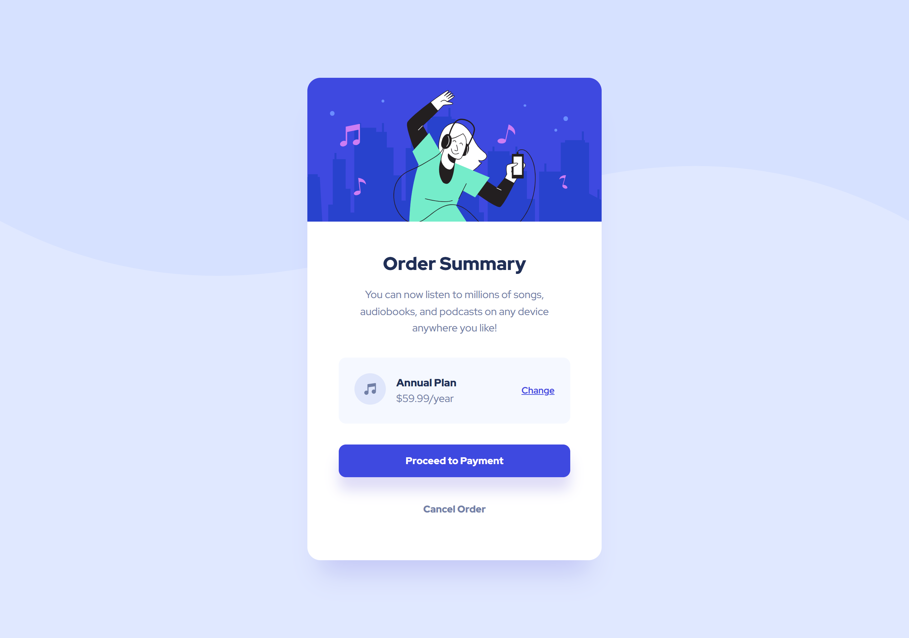

# Frontend Mentor - Order summary card solution

This is a solution to the [Order summary card challenge on Frontend Mentor](https://www.frontendmentor.io/challenges/order-summary-component-QlPmajDUj). Frontend Mentor challenges help you improve your coding skills by building realistic projects.

## Table of contents

- [Overview](#overview)
  - [The challenge](#the-challenge)
  - [Screenshot](#screenshot)
  - [Links](#links)
- [My process](#my-process)
  - [Built with](#built-with)
  - [What I learned](#what-i-learned)
  - [Useful resources](#useful-resources)
  - [AI Collaboration](#ai-collaboration)
- [Author](#author)

## Overview

### The challenge

Users should be able to:

- See hover states for interactive elements
- View the optimal layout for the component depending on their device's screen size

### Screenshot



### Links

- Solution URL: [Add solution URL here]()
- Live Site URL: [Order Summary Card](https://freedev-group.github.io/order-summary-component-main-Prince/)

## My process

### Built with

- Semantic HTML5 markup
- CSS custom properties
- Flexbox
- Mobile-first workflow

### What I learned

One of the key learnings from this project was managing complex background patterns that change based on the viewport size. Using CSS custom properties also made it significantly easier to manage the color palette.

```css
/* CSS custom properties */
:root {
  --pale-blue: hsl(225, 100%, 94%);
  --bright-blue: hsl(245, 75%, 52%);
}

body {
  background-image: url("../images/pattern-background-mobile.svg");
  background-size: contain;
}

@media (min-width: 768px) {
  body {
    background-image: url("../images/pattern-background-desktop.svg");
    background-size: 100% auto;
  }
}
```

```html
<!-- Google Fonts -->
<link
  href="https://fonts.googleapis.com/css2?family=Red+Hat+Display:wght@500;700;900&display=swap"
  rel="stylesheet"
/>
```

### Useful resources

- [MDN Web Docs - CSS](https://developer.mozilla.org/en-US/docs/Web/CSS) - This is my go-to reference for anything related to CSS properties and layout.
- [W3Schools CSS Tutorial](https://www.w3schools.com/css/) - Great for quick examples and testing out new concepts.

### AI Collaboration

I used **Antigravity**, an AI assistant, to help me:

- Plan the initial architecture.
- Extract styles from the design images.
- Refactor my CSS into a separate file for better organization.
- Generate this documentation.

## Author

- Frontend Mentor - [@hacp0012](https://www.frontendmentor.io/profile/hacp0012)
